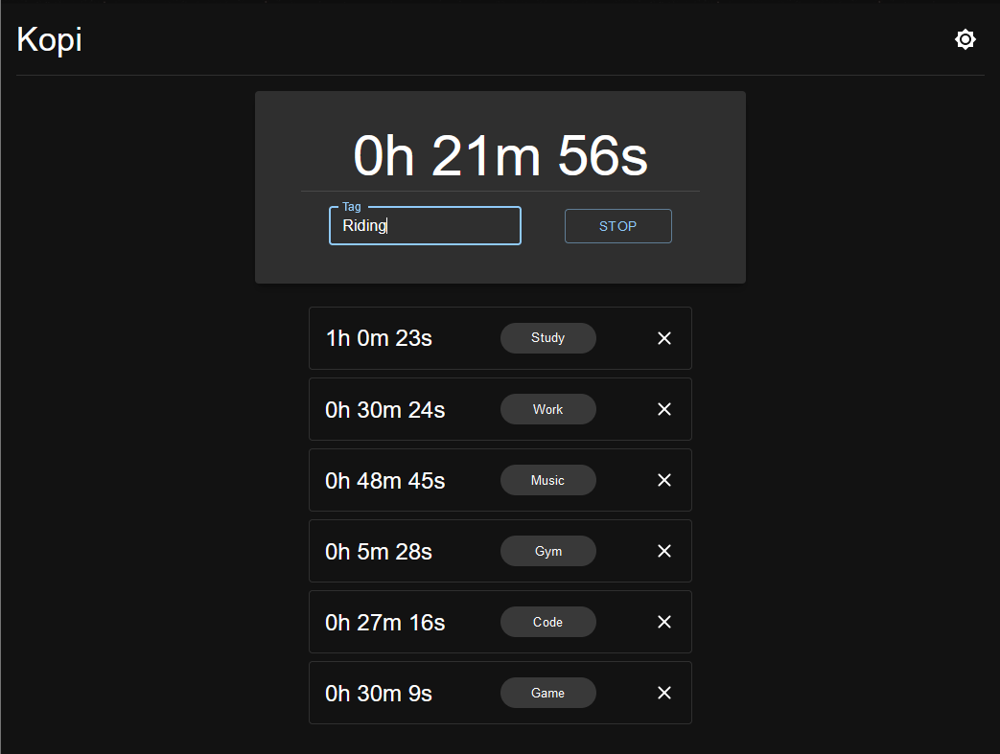

# Kopi

Kopi is a simple and efficient tool to track and manage your time effectively. It allows you to log your activities, record durations, and keep track of your tasks and projects. Whether you're a freelancer, a student, or a professional, this app can help you stay organized and make the most of your time.

## Features

- Log time entries for various activities
- Assign tags to time entries
- Edit and delete existing time entries
- User-friendly and intuitive interface

## Screenshot

## Contributing

Contributions are welcome! If you have any ideas, suggestions, or bug reports, please open an issue or submit a pull request. Make sure to follow the established code style and guidelines.

## License

This project is licensed under the GPL-3.0 License.

## Contact

If you have any questions or inquiries, feel free to contact the project maintainer at abhirajshourya@gmail.com
